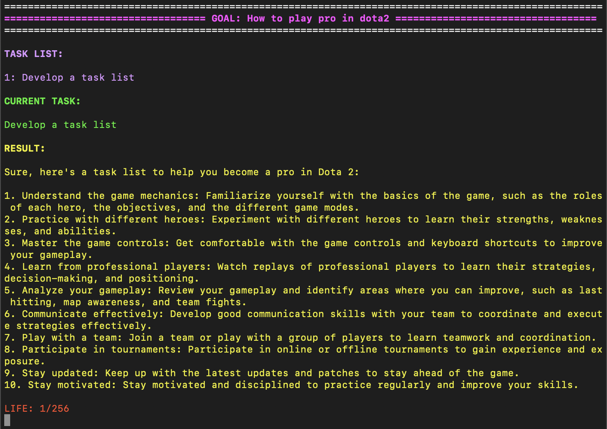

# AAGPT

Auto-Agent-GPT (a.k.a AAGPT) is another experimental open-source application showcasing the capabilities of large language models.

<div align="center">
  
</div>

## Features
- Memory support
  - GPT as memory
  - Vector database as memory (requires a PINECONE API key)
- Lifespan limit for an agent (may save money)

## Installation 
To install AAGPT, follow these steps:

1. Clone the AAGPT repository from GitHub and navigate to the downloaded folder.
    
    ```bash:
    git clone git@github.com:hyintell/AAGPT.git
    cd AAGPT
    ```
2. Use the following command in your terminal with pip:

    ```bash
    pip install -r requirements.txt
    ```
## Setup
After installing AAGPT, you will need to set up related APIs to use the application. You can do this by following these steps:
1. Navigate to the setup folder in the AAGPT directory:
    ```bash
    cd setup
    ```
2. In the `setup` folder, there are two game settings, `game.yaml` which using the Chatgpt as momery store and `game2.yaml` which using the Pinecone as momery store. You can choose one of them to set up the API.
3. In the `game.yaml` file, you will use GPT as memory store, so please fill in the following information:
* `openai_api_key`: Your OpenAI API key. If you don't have one, you can create a free account and get an API key from the OpenAI website.
* `openai_model`: The OpenAI ChatGPT model to use. Choose from "gpt-3.5-turbo", "gpt4", or "text-davinci-003".
* `env_openai_api_key`: OpenAI ChatGPT Key for env, you can keep same as the common.
* `agent_openai_api_key`: OpenAI ChatGPT Key for agents, you can keep same as the common.
* `goal`: The main objective of the AI agent.
* `init_task`: The initial tasks to be appended to the task list.
* `agent_life`: The life-time of the agents, in default, we set it to 256.

Note: Optionally, you can use `game2.yaml` which using Pinecone as memory store. In addition to the above settings, you will need to fill in the following information:
* `agent_pinecone_api_key`: The form will be a list `[Your Pinecone API , Your Pinecone Region]`, the first is pinecone API, and second will be the region of your index, you can get it from the Pinecone website.
* `agent_pinecone_index`: The index name of the Pinecone index to use. In default, we use `aagpt_agent_index`.


## Usage
After setting the correct APIs, you can test AAGPT by executing the `aagpt.py` file in your terminal:

```bash
python aagpt.py 
```

Once AAGPT is running, you can start interacting with it by typing in prompts and observing its responses.

If you want to change the setup or memory setting, you can use the following command:

```bash
python aagpt.py --world_root setup/game2.yaml
```

## Todo
- [ ] UI
- [ ] More memory support
- [ ] Multi-agent support
- [ ] More LLMs support

## Acknowledgement  
  
We are deeply grateful for the contributions made by open-source projects: [Auto-GPT](https://github.com/Significant-Gravitas/Auto-GPT) and [BabyAGI](https://github.com/yoheinakajima/babyagi).