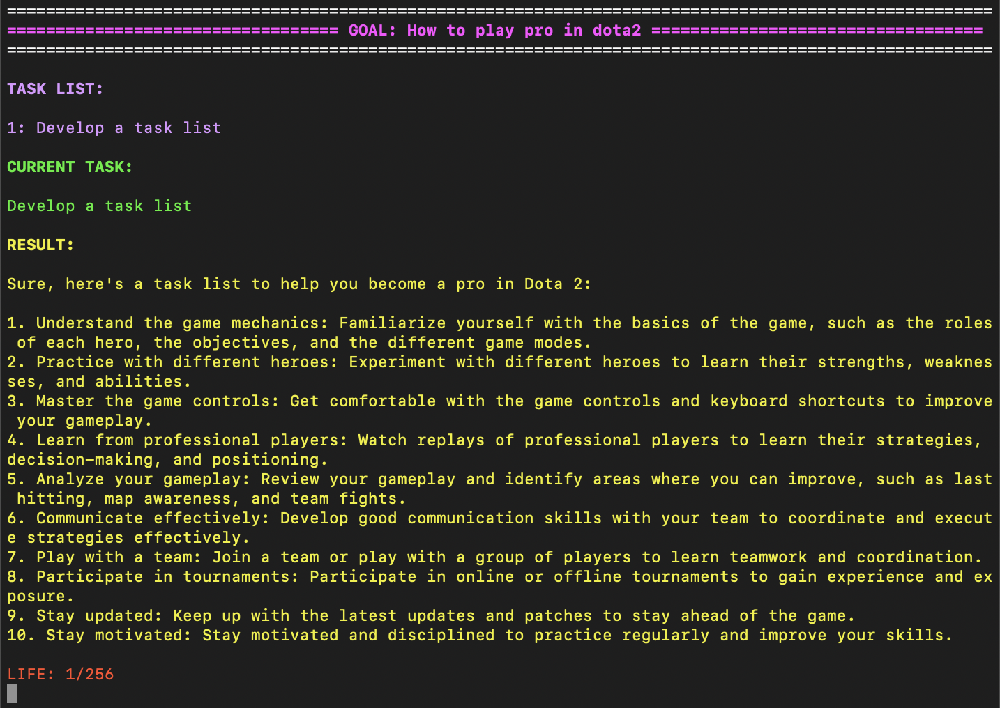

# AAGPT 自动代理GPT

Auto-Agent-GPT（AAGPT）是一个实验性的开源应用程序，目的是展示大型语言模型的能力。

<div align="center">
  
</div>

## 特性
- 不同的记忆储存方式
  - 使用Prompt，用GPT本身作为记忆处理
  - 利用向量数据库用作内存（需要PINECONE API密钥）
- 为执行的代理设置寿命限制，以达到可以节省成本的目的

## 安装 
要安装AAGPT，请按照以下步骤进行操作：

1. 从GitHub克隆AAGPT存储库并导航到下载的文件夹。
    
    ```bash:
    git clone git@github.com:hyintell/AAGPT.git
    cd AAGPT
    ```
2. 在终端中使用以下命令和pip：

    ```bash
    pip install -r requirements.txt
    ```
## 快速尝试
只需要上述两步，您就可以并结合您的OpenAI API密钥来使用AAGPT的自然语言处理能力。这将为您提供一个强大的工具，使您能够自动化许多与文本处理相关的任务，例如文本摘要、机器翻译、文本分类、问答系统等。使用AAGPT，您可以快速创建自己的文本处理应用程序，并为您的项目带来更高的生产力和创造力。

1. 导航并打开 `setup/game.yaml` 文件， 在 `openai_api_key` 空处输入您的penAI API密钥.

2. 回到上层文件夹，并运行 `aagpt.py` 文件：

    ```bash
      python aagpt.py 
    ```
## 详细设置以及参数
为了更详细的使用AAGPT，您需要设置相关的API和参数才能使用该应用程序。您可以按照以下步骤完成此操作:
1. 导航到 `setup` 文件夹。
    ```bash
    cd setup
    ```
2. 在`setup`文件夹中有两个环境设置文件，分别是`game.yaml`和`game2.yaml`.他们分别代表两个不同的游戏设定。`game.yaml`将Prompt储存，并使用Chatgpt作为内存处理。`game2.yaml`将生成的结果储存为向量形式，并使用Pinecone作为云端内存处理工具。您可以选择其中一个来设置API。
3. 以 `game.yaml` 文件为例子, 你将使用ChatGPT作为记忆处理方式，因此您需要填写以下相关信息:
* `openai_api_key`:您的OpenAI密钥. 如果您没有密钥，您可以在OpenAI网站上创建一个免费账户并获取它.
* `openai_model`: 您想要使用的OpenAI模型. 在默认情况下，我们使用的是 `"gpt-3.5-turbo` 模型. （可选择以下模型："gpt-3.5-turbo"、"gpt4"或"text-davinci-003"。）
* `env_openai_api_key`: 针对于环境的OpenAI密钥，您可以与上面的密钥保持一致.
* `agent_openai_api_key`: 针对于代理的OpenAI密钥，您可以与上面的密钥保持一致.
* `goal`: 您想要达到的目标或者问题，aagpt会围绕着这个问题进行任务的建设的讨论，例如：`"怎样解决辛普森悖论?"`
* `init_task`: 传递给aagpt任务列表最初始的任务，提出的任务越想详细，aagpt就会有更好的引导，例如：`"辛普森悖论的定义是什么，在什么情况下会出现这个悖论，列出解决的这个问题的任务列表"`
* `agent_life`: 代理运行的上限，默认情况下是256次更新.

另外：您可以选择使用以 Pinecone 作为内存存储，即 `game2.yaml`环境设定文件。 除了上述设置外，您还需要填写以下信息：
* `agent_pinecone_api_key`: 填入的格式应为`[Pinecone API, Pinecone Region]`, 其中，`Pinecone API`为Pinecone密钥, `Pinecone Region`为服务器地区. 两者都可以Pinecone的API界面找到。如果您没有相关密钥，您可以在Pinecone网站上创建一个免费账户并获取它.
* `agent_pinecone_index`: 要使用的 Pinecone 记忆库索引名称。 默认情况下，我们使用“aagpt_agent_index”。需要注意的是，免费的 Pinecone 账户只能创建一个索引，因此您需要确保您的 Pinecone 账户中没有其他索引或者充值以创建更多的索引。


## 使用
设置正确的 API 后，您可以通过在终端中执行 `aagpt.py` 文件来测试 AAGPT：
```bash
python aagpt.py 
```

AAGPT 运行后，您可以通过输入提示并观察其响应来开始与其交互。

如果要更改环境的设置，可以使用以下命令：

```bash
python aagpt.py --world_root setup/game2.yaml
```

## 未来的工作
- [ ] 一个网页端的界面
- [ ] 支持更多的记忆储存方式
- [ ] 支持多个智能体代理的回答和动作
- [ ] 支持更多现有的LLM的模型

## 鸣谢
  
我们非常感谢开源项目所做的贡献： [Auto-GPT](https://github.com/Significant-Gravitas/Auto-GPT) and [BabyAGI](https://github.com/yoheinakajima/babyagi).
